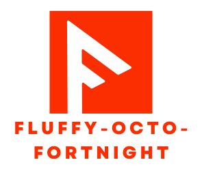

<p align="center">
    
</p>
<h1 align="center">Welcome to fluffy-octo-fortnight 👋</h1>
<p>
  
  <a href="#" target="_blank">
    
  </a>

<a href="https://sergejkembel.github.io/fluffy-octo-fortnight/"></a>
  <a href="https://twitter.com/sergej_kembel" target="_blank">
    
  </a>
</p>

> An example project to prove my knowledge.

> These are the requirements:
>
> > Build an API to display and store the following information:
> > ```
> > eventTitle
> > eventDate
> > eventCity
> > 
> > tickets[].barcode (alphanumeric, eight digits maximum)
> > tickets[].firstName 
> > tickets[].lastName
> > ```
> > The data does not have to be stored in a database but can be stored at runtime. It should be ensured that the SOLID principles are observed, so that, for example, the data stored at runtime could be exchanged for a database by making small adjustments.
> >
> > What also needs to be done:
> > - [x] Dockerize laravel application into a image based on current version
> > - [x] Make a OpenAPI Specification that can be imported in postman for manual api testing


## Requirements
> - PHP 8.1
> - Composer

## Setup / Install
```sh
# (OPTIONAL) configure alias for vendor/bin/sail for productive usage
# once you have that set up, use sail instead of /vendor/bin/sail in the following commands
alias sail='[ -f sail ] && bash sail || bash vendor/bin/sail'
```


```sh
# for starting a "productive" environment
mkdir fluffy-octo-fortnight && cd fluffy-octo-fortnight
curl https://raw.githubusercontent.com/SergejKembel/fluffy-octo-fortnight/master/.docker/docker-compose.yml -O | docker-compose up -d

# start dev environment
git clone https://github.com/SergejKembel/fluffy-octo-fortnight.git && cd fluffy-octo-fortnight
cp .env.example .env
composer install
vendor/bin/sail up -d
vendor/bin/sail artisan key:generate
```

## Usage

```sh
# open bash in container for debugging
vendor/bin/sail bash
```

## Run tests

```sh
vendor/bin/sail artisan test
```

## Software / Libraries / Frameworks used
> - [Composer](https://getcomposer.org/)
> - [Laravel](https://laravel.com/)
> - [Laravel Sail](https://laravel.com/docs/9.x/sail)
> - [Docker](https://www.docker.com/)
> - [Swagger.io](https://swagger.io/)

## Author

👤 **Sergej Kembel**

* Github: [@sergejkembel](https://github.com/sergejkembel)
* LinkedIn: [@sergej-kembel](https://linkedin.com/in/sergej-kembel)

## Show your support

Give a ⭐️ if this project helped you!
